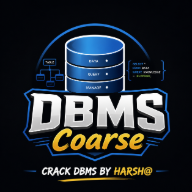

<div align="center">



# DBMS Digital Textbook


<p>
  A premium DBMS digital textbook built with simple HTML, CSS, and JavaScript.
  The project is designed as a complete learning resource for Database Management System, with a course roadmap, chapter reading experience, progress tracking, revision notes, and quizzes.
</p>

<p>
  
  
  
  
  
</p>

</div>

---

## About The Project

DBMS Digital Textbook is a static web-based course for learning Database Management System. It is not a React app, not a backend project, and not a complex framework-based website. It is intentionally built with only:

- HTML
- CSS
- Vanilla JavaScript
- `localStorage`
- `syllabus.txt`

The goal is to make DBMS feel like a premium digital engineering textbook instead of ordinary college notes. The homepage shows the complete course journey, and Chapter 1 provides a deep textbook-style reading experience.

## What This Project Includes

| Section | Description |
| --- | --- |
| Homepage | Premium course introduction with complete DBMS roadmap |
| Roadmap | All five syllabus units organized into chapters |
| Progress Dashboard | Course progress, unit progress, current chapter, remaining chapters, and estimated hours |
| Chapter Page | Reading progress bar, sticky table of contents, callouts, examples, tables, quiz, checklist, and revision notes |
| Theme Toggle | Light and dark mode with saved preference |
| Responsive Design | Works on desktop, tablet, and mobile |
| Local Progress | Progress is saved in the browser using `localStorage` |

## Why This Project Exists

DBMS is usually studied from many scattered resources: notes, PDFs, videos, and random websites. This project brings the learning experience into one clean digital textbook.

It focuses on:

- Complete syllabus coverage
- Clear explanations
- Visual learning
- Exam preparation
- Revision support
- Simple browser-based access

## Course Roadmap

The course is based on the official DBMS syllabus and is divided into five units.

**Unit I - Introduction**

Overview, DBMS vs file system, database architecture, data models, schema, instances, data independence, database languages, DDL, DML, database interfaces, overall DBMS structure, and ER modeling.

**Unit II - Relational Data Model and Language**

Relational model concepts, integrity constraints, keys, relational algebra, relational calculus, SQL fundamentals, SQL commands, tables, views, indexes, queries, joins, set operations, cursors, triggers, and procedures.

**Unit III - Database Design and Normalization**

Functional dependencies, normal forms, 1NF, 2NF, 3NF, BCNF, inclusion dependency, lossless join decomposition, multivalued dependency, join dependency, and database design approaches.

**Unit IV - Transaction Processing Concept**

Transaction systems, serializability, schedules, recoverability, recovery from transaction failures, log-based recovery, checkpoints, deadlock handling, and distributed databases.

**Unit V - Concurrency Control Techniques**

Concurrency control, locking techniques, timestamp protocols, validation-based protocol, multiple granularity, multiversion schemes, recovery with concurrent transactions, and Oracle case study.

## Current Status

- Homepage is designed as a complete DBMS course dashboard.
- Full roadmap is generated from `syllabus.txt`.
- Chapter 1 is unlocked and available.
- Remaining chapters are shown as locked roadmap chapters.
- Light and dark themes are available.
- Progress is saved locally in the browser.

## Folder Structure

```text
DBMS/
├── css/
│   ├── style.css
│   └── chapter.css
├── img/
│   └── favicon/
├── js/
│   ├── app.js
│   ├── chapter1.js
│   └── data.js
├── unit-1/
│   └── chapter1.html
├── index.html
├── syllabus.txt
└── README.md
```

## Tech Stack

| Purpose | Technology |
| --- | --- |
| Structure | HTML5 |
| Styling | CSS3 |
| Interactions | Vanilla JavaScript |
| Theme and progress storage | Browser `localStorage` |
| Course source | `syllabus.txt` |

## How To Use

No installation is required.

1. Download or clone the project.
2. Open `index.html` in your browser.
3. View the course roadmap.
4. Start Chapter 1.
5. Use the progress tracker, reading tools, quiz, checklist, and revision sections.

That is all. This project is designed to work as a simple static HTML/CSS/JS course.

## Learning Philosophy

This project follows a textbook-first learning approach:

- Explain concepts from beginner level.
- Show why each topic exists.
- Use examples instead of only definitions.
- Use visual blocks, tables, and callouts where helpful.
- Support long reading sessions with clean typography and calm colors.
- Keep revision and exam preparation inside the same learning flow.

## Future Plans

- Complete Chapter 2 for ER model concepts.
- Complete Chapter 3 for advanced ER and EER modeling.
- Add full textbook chapters for Units II, III, IV, and V.
- Improve practice questions and university-question sections.
- Add more revision-focused learning tools.

## Author

**Harsh**

Portfolio: [https://lucifer01430.github.io/Portfolio](https://lucifer01430.github.io/Portfolio)

This project is created as a premium digital DBMS learning resource focused on clarity, depth, revision, and semester exam preparation.

## Contact

For feedback, suggestions, or collaboration, contact through the portfolio:

[Contact Harsh](https://lucifer01430.github.io/Portfolio)

---

<div align="center">

<strong>Built with HTML, CSS, and JavaScript for focused DBMS learning.</strong>

</div>
